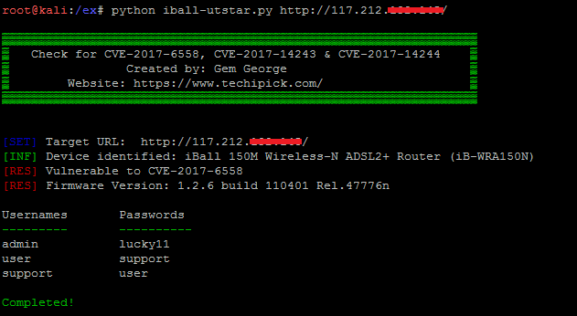
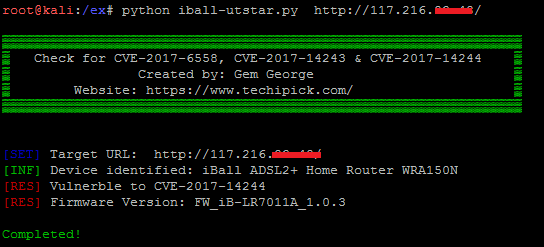

# iBall & UTStar Authentication Bypass & Information Disclosure Vulnerabilities
POC checks for CVE-2017-6558, CVE-2017-14243 &amp; CVE-2017-14244

# Screenshots

# References
1. https://www.techipick.com/iball-baton-adsl2-home-router-utstar-wa3002g4-adsl-broadband-modem-authentication-bypass
2. https://www.exploit-db.com/exploits/42739/
3. https://www.exploit-db.com/exploits/42740/
4. https://www.youtube.com/watch?v=8GZg1IuSfCs
